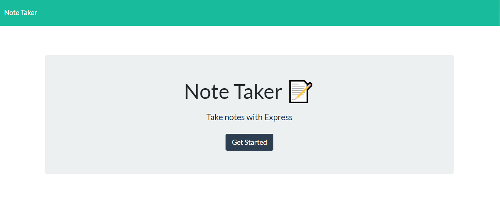
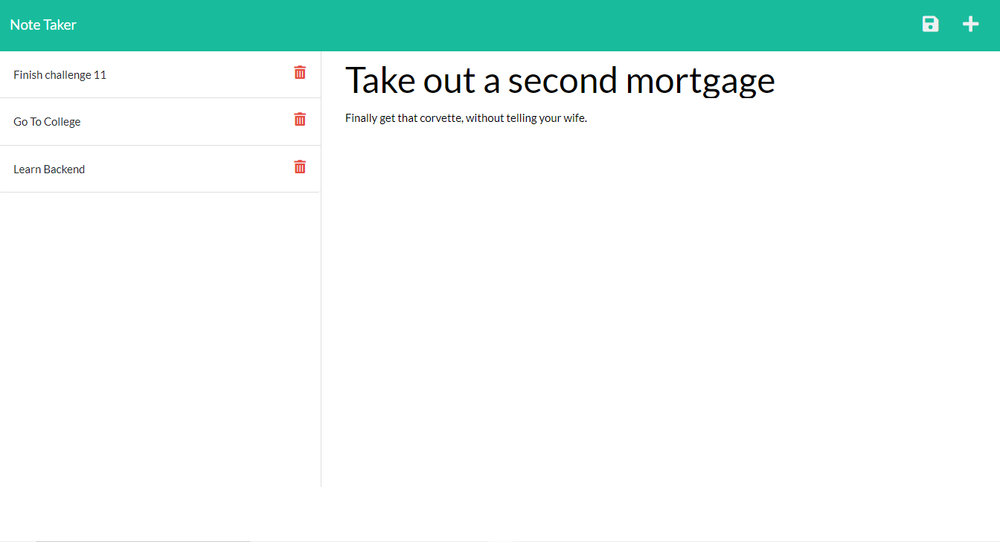

# Note Taker

## Description

A simple app to take and delete notes as needed.
Provide a short description explaining the what, why, and how of your project. Use the following questions as a guide:

- My motivation for this build was to have a place to store notes about projects.

- I built this to have a safe storage option for important notes.

- This app solves the problem of lost notes.

- In building this application, I learned the basics of backend. Which I am now much more understanding of.

## Table of Contents

- [Installation](#installation)
- [Usage](#usage)
- [Screenshots](#screenshots)
- [Credits](#credits)
- [License](#license)

## Installation

Run "npm i" in the integrated terminal.

## Usage

https://notes-from-space.herokuapp.com/

Run "node server.js" in the integrated terminal.

## Screenshots

  
  

